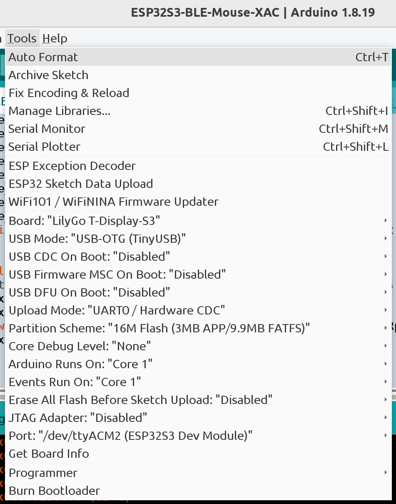
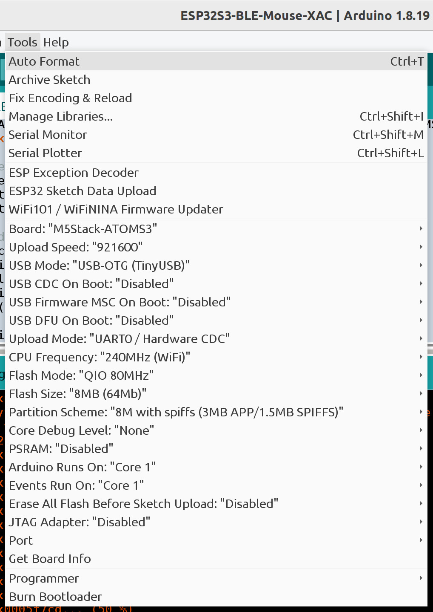

# BLEMouse2XAC -- BLE Mouse/Trackball to Xbox Adaptive Controller Joystick


The Windows 11 laptop is running the Xbox Accessory app to fine tune the
joystick sensitivity (mouse in disguise). On the left side, the small white box
is an M5Stack AtomS3 (ESP32-S3 inside). The AtomS3 is communicating with the
greenish mouse over BLE. The AtomS3 appears as a USB joystick to the XAC. Also
note the black cable running off the left side of the picture. The XAC is
powered by a 5V 2A wall adapter. This is needed to power the ESP32-S3 boards.

On the right side, the gadget that looks like a thumb drive with a display is a
LilyGo T-Dongle S3 (ESP32-S3 inside). This is running the same firmware as the
AtomS3. The T-Dongle communicates over BLE to the thumb trackball mouse.

There is no reason to use two different ESP32-S3 devices. Just one is fine or
two of the same type.

## Hardware

### Xbox Adaptive Controller with a 5V 2A power supply

The ESP32-S3 draws more than 100 mA but the XAC can only supply 100 mA from its
USB joystick ports when used without a power supply.

### LilyGo T-Dongle S3

This device is available with and without a built-in display. Set the IDE board
to "LilyGo T-Display-S3". Note this is not strictly correct because the
T-Dongle-S3 is used but the T-Display-S3 is close enough. Hopefully,
T-Dongle-S3 option will be added soon. Both devices have 16 MB of Flash.

To put the board in upload mode, first unplug or power off the board. Press and
hold the button. Plug in or power on the board with the button held down.
Release the button. Start uploading

Power cycle the board after the upload is done.



### M5Stack AtomS3

This device is available with and without a built-in display. Set the IDE board
to "M5Stack AtomS3". Both boards have 8 MB of Flash. To put the board in upload
mode, press and hold the small button on the side for about 2 seconds until a
green LED lights up inside. Start uploading.

Power cycle the board after the upload is done.



## Software

* [Arduino IDE 1.8.19](https://www.arduino.cc/en/software)
* [Arduino ESP32 Getting Started](https://docs.espressif.com/projects/arduino-esp32/en/latest/getting_started.html)

Install the following libraries using the Arduino IDE library manager.

* "OneButton" by Matthias Hertel
* "FastLED" by Daniel Garcia
* "NimBLE-Arduino" by h2zero
* "M5GFX" by M5Stack

Install the following library by downloading the ZIP file from the following
link. Then install using the IDE "Install .ZIP library" option.

* [ESP32 flight stick](https://github.com/esp32beans/ESP32_flight_stick)

If not using the LilyGo board, skip this step. Install the following library
for the display by downloading the ZIP file from the following link. Then
install using the IDE "Install .ZIP library" option. In addition, copy
User_Setup_Select.h to <Arduino library directory>/TFT_eSPI-master. This
selects the correct display type for the board.

* [TFT_eSPI by Bodmer](https://github.com/Bodmer/TFT_eSPI)

### Arduino library directory

The Arduino library should include these directories.

```
ESP32_flight_stick-main
FastLED
M5GFX
NimBLE-Arduino
OneButton
TFT_eSPI-master
```

## Compiler Warnings

Ignore the warning messages about "WM_NOTEMP" and "No hardware SPI pins defined".

## Display Messages

### "Scanning"

Waiting for a BLE mouse or trackball. The first time a mouse/trackball is used,
it must be paired. See the device instructions for pairing. It usually is done
by holding a button down until an LED starts blinking.

### "Mouse to XAC"

The program is converting mouse/trackball buttons and movement to joystick
buttons and movements.

### "Disconnect Scanning"

The mouse/trackball will go into a power save mode when idle which disconnects
BLE. Pressing a button should wake up the device and reconnect without pairing.

## Notes

### Wireless Mouse/Trackball

Not all wireless mice and trackballs support BLE. Some use the older Bluetooth
Classic protocols. Some use proprietary (not Bluetooth or WiFi) wireless
protocols. The ESP32-S3 only works with BLE devices.

### USB Debug

#### Debug output on USB enabled
"USB CDC On Boot:" "Enabled"
#define USB_DEBUG 1

#### Debug output on USB disabled
"USB CDC On Boot:" "Disabled"
#define USB_DEBUG 0

## Related Project

The [mouse2xac](https://github.com/touchgadget/mouse2xac) project works for USB
mice and trackballs.
